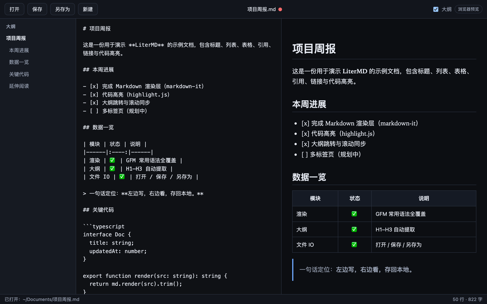
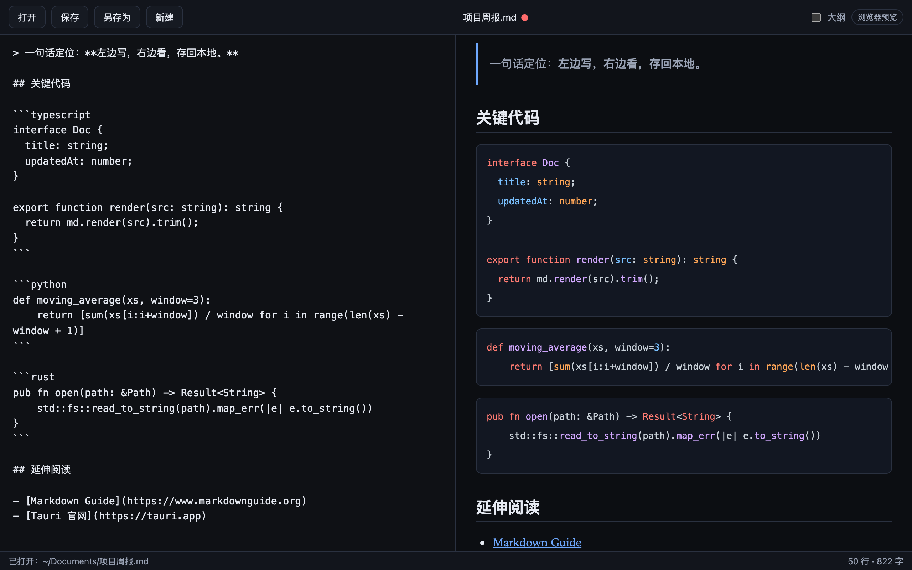

# LiterMD

**左写右看的 Markdown 桌面编辑器**

一个跑在 macOS 本地的极简 Markdown 工具：左边写，右边实时预览，保存直接写回原文件。

技术栈：`Tauri 2` · `TypeScript` · `Vite` · `markdown-it` · `highlight.js`

---

## 截图

主界面——大纲、编辑区、实时预览三栏并排：



代码高亮——TypeScript / Python / Rust 等常用语言自动识别着色：



---

## 这是个什么东西

LiterMD 解决一个很具体的问题：**Markdown 预览工具大多只有「看」没有「写」，编辑器又太重**。

你只想写一篇笔记、读一份 README、改一份文档，不想装臃肿的编辑器，也不想来回切窗口预览。它就是：

- **打开即写**，不用先想存到哪
- **写完即存**，`⌘S` 直接写回原路径，不用「另存为」到某个地方
- **所见即所得**，左边敲，右边同步渲染

一句话：**左边写，右边看，存回本地。**

---

## 功能

### 文档编辑

| | |
|---|---|
| 📄 **打开 / 保存 / 另存为 / 新建** | 完整文件生命周期管理 |
| 🔍 **实时预览** | 输入即渲染，60ms 节流，不卡顿 |
| 🗂 **大纲导航** | H1–H3 自动提取，点击平滑跳转到对应标题 |
| ↔️ **滚动同步** | 源码与预览按比例联动，滚哪边另一边跟着走 |
| 🖱 **拖拽打开** | `.md` 文件直接拖进窗口 |
| ⌨️ **快捷键** | `⌘O` / `⌘S` / `⌘⇧S` 全覆盖 |
| 🔒 **未保存提示** | 标题栏 `•` 标记 + 关闭前拦截 |

### Markdown 支持

- 标题、段落、引用、有序/无序列表、任务清单（`- [x]`）
- **表格**（含 `:---:` 对齐）
- **代码高亮**：TS/JS/Python/Rust/JSON/Bash/CSS/HTML/Markdown 等 10+ 语言
- 图片、链接（外链自动 `target="_blank"`）
- 分割线、强调
- 智能排版：自动识别裸 URL、标点转换

### 界面

- 🌓 **暗色主题**（默认，护眼）
- 📐 窗口可缩放，最小 800×500
- 📊 底部状态栏实时显示**行数 / 字数**与当前操作结果
- 🎚️ 大纲面板可一键折叠，让预览占满全宽

---

## 下载使用

### 直接构建（推荐）

在 macOS 上克隆源码并构建：

```bash
git clone <repo-url> litermd && cd litermd
npm install
npm run tauri:build
```

产物在 `src-tauri/target/release/bundle/`：

| 文件 | 说明 |
|------|------|
| `macos/LiterMD.app` | macOS 应用，可直接拖入 `Applications` |
| `dmg/LiterMD_0.1.0_aarch64.dmg` | 磁盘镜像，Apple Silicon |

首次构建需要 10–20 分钟（Rust 依赖较多），之后增量编译很快。

> 当前产物**未签名、未公证**。首次打开若被 Gatekeeper 拦截（「无法验证开发者」），右键点击 dmg / app 选择「打开」，或执行：
> ```bash
> xattr -cr /Applications/LiterMD.app
> ```

### 只构建单一格式

```bash
npm run dmg    # 只出 .dmg
npm run app    # 只出 .app
```

### 清理构建产物

```bash
npm run clean
```

### 系统要求

- **macOS 10.15+**
- Apple Silicon 或 Intel

### 发布新版本

版本号改两处，保持一致：

1. `package.json` → `version`
2. `src-tauri/tauri.conf.json` → `version`
3. `src-tauri/Cargo.toml` → `version`

然后执行 `npm run tauri:build`。

### 使用限制

当前版本默认只能访问**家目录、文稿、桌面、下载**这几个常见位置（macOS 隐私权限 + Tauri scope 限制）。要打开其它路径的文件，需要改 `src-tauri/capabilities/default.json` 扩展权限范围。

---

## 使用说明

### 上手三步

1. 启动 LiterMD
2. 把 `.md` 文件**拖进窗口**，或按 `⌘O` 选择文件
3. 左边写，右边看，`⌘S` 保存

### 快捷键

| 操作 | macOS | Windows / Linux |
|------|-------|-----------------|
| 打开 | `⌘O` | `Ctrl+O` |
| 保存 | `⌘S` | `Ctrl+S` |
| 另存为 | `⌘⇧S` | `Ctrl+Shift+S` |

---

## 从源码开发

<details>
<summary><b>点此展开开发环境准备与命令（点击展开）</b></summary>

### 前置依赖（只需装一次）

1. **Xcode Command Line Tools**
   ```bash
   xcode-select --install
   ```

2. **Node.js 20+**
   ```bash
   brew install node
   ```

3. **Rust（rustup stable）**
   ```bash
   curl --proto '=https' --tlsv1.2 -sSf https://sh.rustup.rs | sh
   rustup update stable   # 装完重开终端
   ```

4. **自检**
   ```bash
   node -v && npm -v && rustc -V && cargo -V
   ```

官方前置条件：[Tauri Prerequisites](https://tauri.app/start/prerequisites/)

### 常用命令

| 命令 | 作用 |
|------|------|
| `npm run tauri:dev` | 启动桌面应用（开发模式，热更新） |
| `npm run dev` | 仅前端，浏览器打开 `localhost:1420` |
| `npm run build` | 前端类型检查 + 打包到 `dist/` |
| `npm run tauri:build` | 打包 `.app` + `.dmg` |
| `npm run dmg` | 只打包 `.dmg` |
| `npm run app` | 只打包 `.app` |
| `npm run clean` | 清理构建产物 |

> `npm run dev` 是浏览器预览模式，功能可用但**保存会变成下载**，无法写回原路径。完整开发请用 `tauri:dev`。

### 技术栈

| 层 | 选型 |
|----|------|
| 桌面壳 | Tauri 2（系统原生 WebView，非 Electron） |
| 前端 | Vite + 原生 TypeScript，无 UI 框架 |
| Markdown | `markdown-it` + `highlight.js` |
| 文件 IO | `@tauri-apps/plugin-dialog` + `plugin-fs` |

### 目录结构

```
litermd/
├── index.html                # 应用骨架
├── src/
│   ├── main.ts               # UI 绑定、状态、快捷键、滚动同步、拖拽
│   ├── markdown.ts           # markdown-it 渲染 + 大纲提取 + 代码高亮
│   ├── file-io.ts            # Tauri / 浏览器双模式文件抽象
│   └── styles.css            # 暗色主题
├── src-tauri/
│   ├── tauri.conf.json       # 窗口配置、CSP、bundle 设置
│   ├── capabilities/         # 权限白名单
│   └── src/lib.rs            # 插件注册
└── docs/images/              # 文档截图
```

`file-io.ts` 里的 `isTauri()` 是双模式的关键：有 Tauri 环境就走原生对话框 + 路径写回，否则降级为浏览器 File API。

### 已知限制

- 编辑区是原生 `textarea`，无行号、无语法着色（指编辑区，预览区有高亮）
- 未实现：多标签、最近文件、导出 PDF/HTML、自定义主题字体、图片拖拽插入、全局搜索替换、macOS 原生菜单栏
- 预览默认禁用原始 HTML（`html: false`）以降低 XSS 风险，需要内嵌 HTML 的话要改配置

### 搬目录后启动失败？

Rust 构建缓存 `src-tauri/target/` 会残留旧绝对路径，导致：

```
failed to read plugin permissions: ... No such file or directory
```

清缓存重新编译即可：

```bash
rm -rf src-tauri/target
npm run tauri:dev
```

</details>

---

## Roadmap

- [ ] 多标签页 / 最近文件
- [ ] 导出 PDF / HTML
- [ ] 自定义主题与字体
- [ ] 图片拖拽插入与相对路径解析
- [ ] 全局搜索替换、拼写检查
- [ ] macOS 原生菜单栏与关于面板
- [ ] 更完整的编辑体验（行号、编辑区语法着色）

---

## License

[MIT](LICENSE) © 2026 the5fire